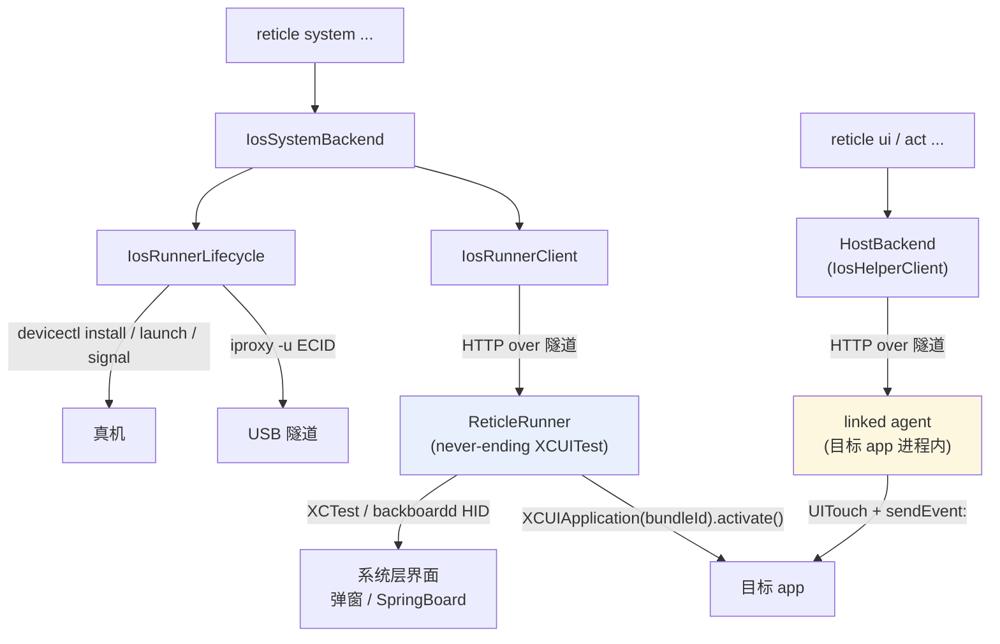
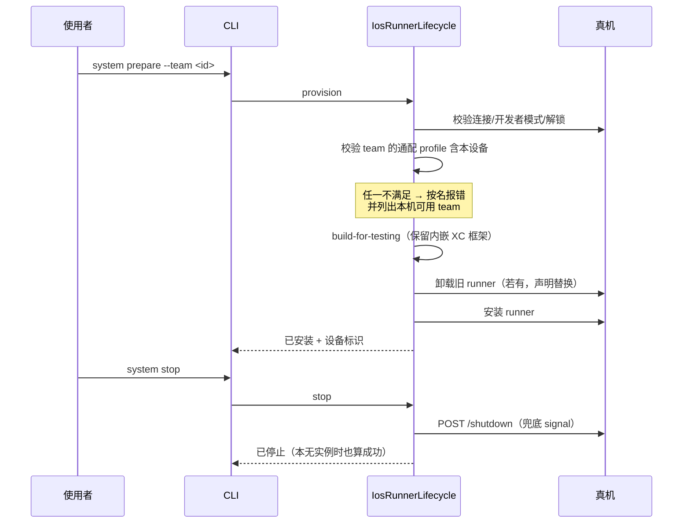
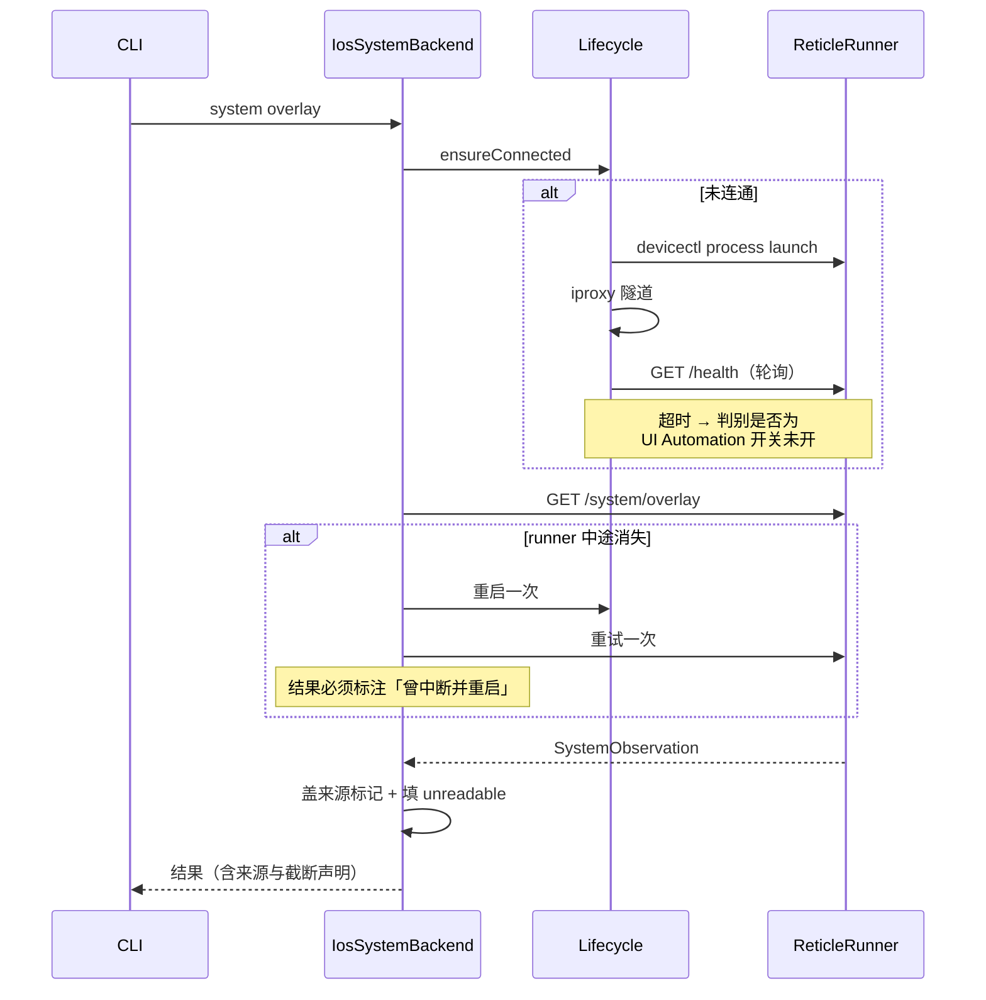
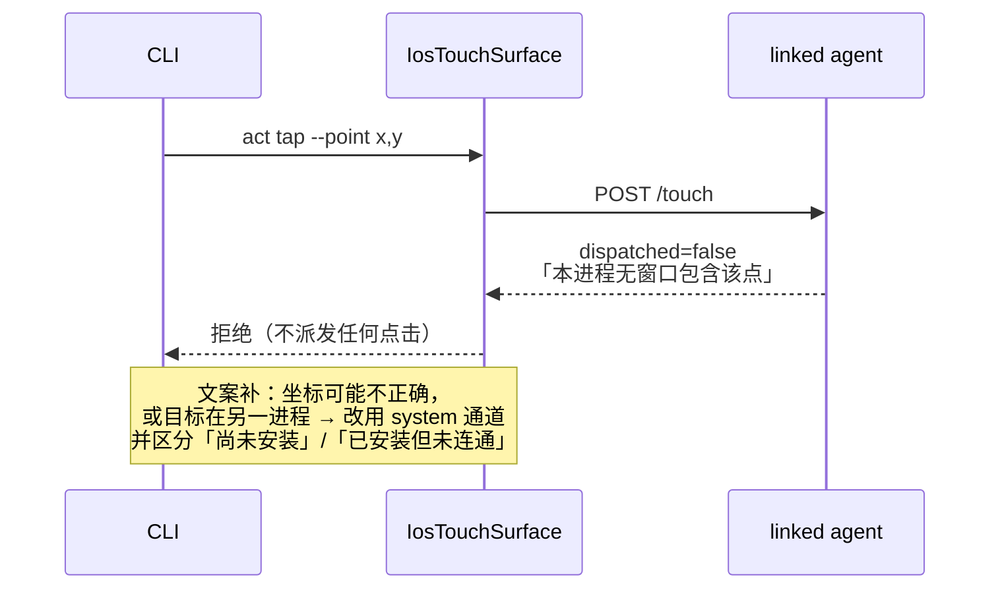

# Implementation Plan: iOS 真机 system scope

**Workspace**: `ios-system-scope` | **Date**: 2026-08-11 | **Spec**: [spec.md](spec.md) | **Explore**: [explore.md](explore.md)
**Input**: Feature specification from `specs/ios-system-scope/spec.md`

---

## Summary

新增一条与 linked agent 平行的 **system 通道**：一个独立签名、常驻在设备上的 XCUITest runner，通过 loopback HTTP 暴露窄接口，供宿主读取「最上层覆盖物」的无障碍树、抓显示级截图、向另一进程派发坐标手势。runner 用 `devicectl device process launch` 独立启动（无需 xcodebuild），常驻靠 never-ending test body，端口沿用既有 `PortMap` 规则、隧道沿用既有 `iproxy`。宿主侧不改 `HostBackend` 协议、不改 `NodeKind`，system 通道的观测结果用**独立类型**表达，从类型上保证它不与 app 内通道的 `Node` 合流。

---

## Architecture Overview



两条通道**并存且互不替代**：agent 看得深（view 层 / Compose / DOM / 样式 / regions）但只在自己进程内；runner 看得浅（只有无障碍一层）但能跨进程。

---

## Key Design Decisions

### Decision 1: system 通道不进 `HostBackend` 协议

- **背景**：宿主已有 `HostBackend` 协议（12 个方法，Android 与 iOS 各一实现）。最省事的做法是往里加 `systemReport` 等方法。
- **选项**：
  - A: 加进 `HostBackend` — 复用现成的命令分发与 backend 生命周期；但 Android backend 被迫实现一个该平台上不存在的能力，只能抛「不支持」，协议从此含平台专属方法。
  - B: 独立的 `IosSystemBackend`，不实现 `HostBackend` — 协议保持跨平台干净；代价是 CLI 侧要多一条 backend 构造路径。
- **结论**：B。依据 explore.md：`HostBackend` 是跨平台共享协议，而 system 通道的方法集与既有 12 个完全不重叠。
- **后果**：`system` 命令分支自行构造 backend，不复用 `ui`/`act` 的 backend 装配；对应 NFR-008（模拟器上请求时直接说明应改用哪条现有命令）。

### Decision 2: 观测结果用独立类型，不复用 `Node` / 不扩 `NodeKind`

- **背景**：spec NFR-002/003 要求来源可区分、读不到的属性显式表达。协议已有 `Node` 与封闭的 `NodeKind`。
- **选项**：
  - A: 复用 `Node`，给 `NodeKind` 加一个取值（如 `systemAxElement`）— 复用渲染与选择器机制；但 `NodeKind` 是 Swift/Kotlin 双写枚举，新增取值要求 Kotlin 侧同步一个 Android 永不产出的值，属已知的协议漂移风险；且 `Node` 的 20+ 个字段里 system 通道能填的不到一半，剩下的要么留空（被误读成「app 真的没有」）要么塞进 `styleGaps`（把「整条通道读不到」硬塞进「这个属性读不到」的语义里）。
  - B: 新增独立类型 `SystemObservation` / `SystemNode`，仅 Swift 侧存在 — 类型上就无法与 `Node` 混用，杜绝合流；不需要 Kotlin 双写，因为 Android 侧无此能力也无此病因。
- **结论**：B。这也正面满足 spec 中「不能与 agent 的 Node 合流」这条硬要求——**用类型系统保证，而不是靠约定**。
- **后果**：system 的输出不能复用现有 `ui tree/compact/...` 渲染器，需要自己的渲染；换来的是不可能误读。`SystemNode` 自带 `unreadable: [String: String]`（形状照抄 `Node.styleGaps` 的「不可达者自报其名」先例），键为属性名、值为不可读原因。

### Decision 3: runner 独立启动，不由 xcodebuild 驱动

- **背景**：spike 用 `xcodebuild test`，每次重建、分钟级，且宿主要背 xcodebuild 生命周期。
- **选项**：
  - A: 每次会话 `xcodebuild test-without-building` 拉起并保活 — 无需额外机制；但宿主要长期持有一个 xcodebuild 子进程，且启动开销大。
  - B: 一次性 `build-for-testing` + 装机，之后每次 `devicectl device process launch` — 已实证（见 explore.md 的 syslog 三行）；对应 Appium 的 `usePreinstalledWDA`，是其官方推荐的性能路径。
- **结论（2026-08-12 订正）**：**B 的具体形式选错了，已改为 A′**。在环境已知良好的设备上实测：`devicectl device process launch` 起来的 runner 拿到了 HID 连接、打印 `Running tests...`，然后数秒内退出，从未执行 test 方法；而 `xcodebuild test-without-building -xctestrun <prepare 时产出的>` 能常驻并应答。

  最终方案：**`build-for-testing` 一次（prepare）+ `test-without-building` 每次会话**。NFR-001 仍然成立——构建只发生在准备阶段，会话启动不构建任何东西。
- **后果**：准备与使用仍是两个显式状态（**已安装** / **已连通**）；代价是宿主必须持有一个 xcodebuild 子进程作为通道的生命周期句柄，且 `stop()` 必须终止它——设备只有一个 automation session，残留的子进程会占住它，让下一次启动以一个看起来毫不相干的原因失败。`build-for-testing` 产出的 runner 包**保留内嵌 `Frameworks/XC*`**（Appium 文档要求删，但 iOS 26 上删了会因 `@rpath/XCTestCore.framework` 加载失败——见 explore.md）。

### Decision 4: 进程内坐标够不到时不自动改道

- **背景**：US5。最诱人的做法是自动改由 system 通道派发。
- **结论**：**不做**。坐标打不到本进程窗口时，最常见的原因是坐标本身写错；自动改道会把「坐标写错」变成「往另一个进程乱点」，比失败更糟。
- **后果**：本次对既有路径的唯一改动是**错误文案**（补充两种可能 + 指引 system 通道 + 区分「尚未安装」/「已安装但未连通」），拒绝行为本身不变。改动点单一：`IosTouchSurface.post()`。

---

## Module Design

### Module: ReticleRunner（新增，设备侧）

**职责**：常驻在设备上的 XCUITest 进程，把 XCTest 的跨进程观察与输入能力通过 loopback HTTP 暴露出去。

**改动概述**：全新模块。一个独立的 Xcode 工程（不依赖、也不链接目标 app），含一个 UITest target，其唯一测试方法启动 HTTP server 后永不返回。

**接口与契约变更**（新增，仅 runner 与宿主之间的私有契约）：

- `GET /health` → runner 版本、屏幕尺寸与点缩放比
- `GET /system/overlay` → 最上层覆盖物及其子树；无覆盖物时返回明确的「无覆盖物」而非空树
- `GET /system/tree?target=<home|bundleId>` → 显式指定对象的树，带节点数上限
- `GET /system/screenshot` → 显示级 PNG
- `POST /system/tap` → 按可操作项标签或坐标派发
- `POST /system/home` → 回到主屏
- `POST /system/activate` → 让指定 bundle id 回到前台
- `POST /shutdown` → 自行退出（供 US1-4 的停止命令使用）

**核心流程（测试方法体）**：

```
1. 起 HTTP server，绑定 PortMap.derivePort(<runner bundle id>)
2. 打开自动化会话（一次，避免每请求重复付开销）
3. 进入 run loop 永不返回          // 常驻的全部秘密
4. 收到 /shutdown 时停 server 并让测试方法返回，进程随之退出
```

> **决策**：`/system/activate` 一律用 `XCUIApplication(bundleIdentifier:).activate()`，**禁止** `.launch()`。`.launch()` 会重启目标 app，直接违反 NFR-005 与 Reticle「观察正在运行的 app」的根本承诺。这条要在代码处以注释钉住，因为 `.launch()` 是 XCUITest 的惯用写法，很容易被后来者「顺手改回去」。

> **实现补充（2026-08-12）**：HTTP handler 必须 `DispatchQueue.main.sync` 派发回主线程执行——XCUIElement 查询在后台 queue 上发起会直接杀死 test，且宿主只看到一个毫无指向性的连接错误。

> **决策**：树遍历必须带节点数上限与深度上限，且**默认只遍历最上层覆盖物**。实测含网页内容的一次全量遍历 126s（每次属性访问都是一次跨进程 AX 查询）。上限触发时返回已读部分 + 截断声明，不返回半截却看起来完整的树。

### Module: IosRunnerLifecycle（新增，宿主侧）

**职责**：把 runner 从「什么都没有」带到「已连通」，以及反向收摊。

**核心流程**：

```
provision(team, device):
  1. 校验设备：已连接 / 开发者模式 / 已解锁     // 缺一即按名报错
  2. 校验签名材料：team 在本机有可用通配 profile 且含本设备
     └─ 不满足 → 报错并列出本机实际可用的 team
  3. build-for-testing（保留内嵌 XC 框架）
  4. 若设备已有旧 runner → 卸载并在结果中声明发生了替换
  5. 安装 runner
  6. 状态 → 已安装

ensureConnected(device):
  1. 若已连通 → 直接返回
  2. devicectl process launch <runner bundle id>
  3. 起 iproxy 隧道（ECID, port, port）
  4. 轮询 /health 直到应答或超时
     └─ 超时 → 判别失败原因并按名报错（见下）
  5. 状态 → 已连通

stop(device):
  1. POST /shutdown（优先，能让 runner 自己干净退出）
  2. 兜底 devicectl process signal
  3. 关隧道
  4. 本无存活实例时也算成功，只说明「本无可停止的实例」
```

> **决策**：失败原因判别必须把「设备端 UI Automation 开关未开」单独识别出来。实测该开关未开时的报错会**伪装**成一个与它无关的连接错误（`exit 74` / `dtxproxy channel refused`），只有在干净重装后才露出 `Timed out while enabling automation mode`。识别依据取自 runner 启动后的失败形态与设备日志特征，而不是把底层报错原样抛给使用者——这是 NFR-006 的落点，也是本需求最容易劣化成「玄学报错」的地方。

### Module: IosRunnerClient（新增，宿主侧）

**职责**：runner 的 HTTP 客户端。

**改动概述**：形状对照现有 `IosAgentHTTP` 建（`get`/`post` + 由端口算 URL），但端口取自 **runner 自己的** bundle id。

> **决策**：端口沿用既有 `PortMap.derivePort`，不新增分配机制。runner 与目标 app 的 bundle id 不同，落到同一端口的概率极低；但 provision 阶段要**显式检测碰撞并报错**，不静默复用——静默复用会让两条隧道抢同一端口，表现为难以归因的间歇失败。

**重试语义**：

```
每个请求:
  1. 发请求
  2. 若连接失败且 runner 进程已不存在:
       a. 重启 runner 一次
       b. 重试该请求一次
       c. 无论成功失败，在结果中标注「runner 曾中断并被重启」
  3. 仍失败 → 报错，不再重启
```

> **决策**：重启这件事**必须出现在结果里**（NFR-011）。重启会打断设备当前的前台状态，对正在验证的流程是可观察的干扰；隐瞒它会让使用者把这个干扰误判成被测目标自身的行为——这与 Reticle「只出证据」的定位直接冲突。

### Module: IosSystemBackend（新增，宿主侧）

**职责**：`system` 命令族的执行者，编排 lifecycle + client，产出带来源标注的结果。

**接口与契约变更**：不实现 `HostBackend`（见 Decision 1），自成一套方法。

**核心流程**：

```
1. 若目标是模拟器 → 直接说明现有通道已覆盖，指出该用哪条命令   // NFR-008
2. ensureConnected
3. 调 client 取结果
4. 给结果盖来源标记（system 通道 / 作用于哪个进程）           // NFR-002
5. 对该通道读不到的属性，填 unreadable 而非留空                // NFR-003
```

### Module: 协议类型（新增，`reticle-swift/Sources/ReticleProtocol`）

**改动概述**：新增 `SystemObservation` / `SystemNode`，**不改** `Node`、**不改** `NodeKind`。

**接口与契约变更**：

- [新增] `SystemNode`：`ref` / `parentRef` / `children` / `role`（由 ElementType 映射）/ `label` / `value` / `placeholder` / `testId` / `frame` / `isEnabled` / `isHittable` / `unreadable: [String: String]`
- [新增] `SystemObservation`：`root` / 扁平节点表 / `truncated`（截断了多少、上限多少）/ `sourceChannel` / `targetProcess`
- [不变] `Node`、`NodeKind`、`HostBackend` — 均不动，避免协议双写漂移

> **决策**：`SystemNode` **不设** `isVisible` 字段。runner 只有语义不同的 `isHittable`，设一个同名字段会诱使调用方按 `Node.isVisible` 的语义去读它。`isVisible` 改为出现在 `unreadable` 里，明说这条通道读不到。同理不设 `checked` / `expanded` / `isFocusable` / 样式类字段。`hasFocus` 也不设——实测它在整棵 web 内容树上恒为 `true`，一个恒真的字段比没有这个字段更有害。

### Module: CLI（变更）

**改动概述**：在既有两级 dispatch 表里加 `system` 一支，对称于 `ui`。

**接口与契约变更**：

- [新增] `system prepare --team <id>` / `system stop` / `system status`
- [新增] `system overlay` / `system tree --target <home|bundleId>` / `system screenshot`
- [新增] `system overlay` / `system tree [home|<bundle-id>]`（读取目标是**位置参数**，不是 `--target`——那个 flag 在本 CLI 中已表示平台）
- [新增] `system tap` / `system home` / `system activate`
- [变更] 真机上 `act tap/swipe/drag/scroll-to` 打不到本进程窗口时的**错误文案**（补两种可能 + system 通道指引 + 区分未安装/未连通）；拒绝行为不变

### Module: 文档（变更）

- `docs/boundaries.md`：更新 "Real-device iOS input" 与 "Out-of-process system UI" 两行——进程内不可达的事实不变，补上「system 通道可达，且它是另一条通道」，并按四列格式登记本能力自身的新边界（无 DOM、无样式、无 regions、遍历开销）。对应 NFR-009。
- `docs/ios.md`：在 "Honest boundaries" 段补机制细节——runner 拿到 backboardd HID 连接、独立启动的三行 syslog 证据、UI Automation 开关的伪装报错、iOS 26 上不可删内嵌 XC 框架。

---

## Sequence Diagrams

### US1: 准备与收摊



### US2 / US3: 读与驱动（含首次连通与意外重启）



### US5: 进程内够不到时的指引（行为不变，仅文案）



---

## Design Artifacts

| 产物 | 条件 | 本 run 是否生成 |
|------|------|------|
| explore.md | **必须** | ✅ 已生成 |
| plan.md | **必须** | ✅ 本文件 |
| test-plan.md | **必须** | ✅ 已生成 |
| data-model.md | 涉及数据存储 | ❌ 不涉及持久化数据模型 |
| contracts/api-change.md | 大规模或跨团队 API 契约变更 | ❌ runner 契约是宿主与 runner 之间的私有契约，无跨团队联调，已内联在 Module Design |
